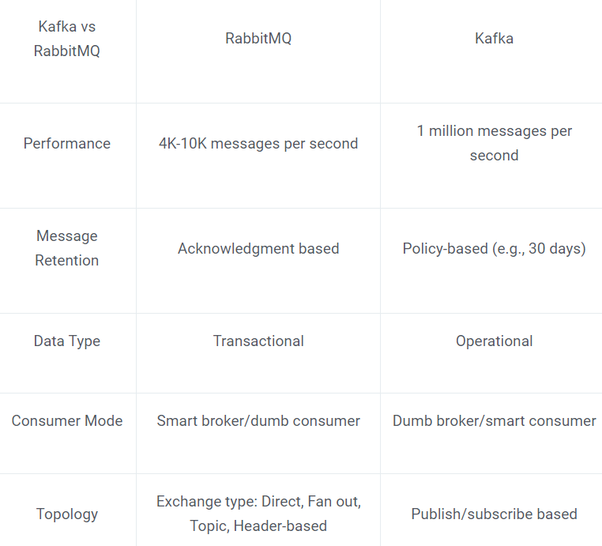

# Apache Kafka

## Overview

Apache Kafka is an open-source distributed streaming platform that can simultaneously ingest, store, and process data across thousands of sources.

Apache Kafka originated at LinkedIn in 2011 as a solution for platform analytics for user activity at scale in social networking. The functionality has been extended through open source development across enterprise IT organizations to support data streaming, data pipeline management, data stream processing, and data governance across distributed systems in event-driven architecture. Kafka is open source under an Apache 2.0 license.

## Elements

Kafka is a distributed system consisting of servers and clients that communicate via a high-performance binary TCP network protocol.

**Servers**: Kafka is run as a cluster of one or more servers. Some of these servers form the storage layer, called the brokers. Other servers run Kafka Connect to continuously import and export data as event streams.

Kafka cluster is highly scalable and fault-tolerant.

**Clients**: They allow you to write distributed applications and microservices that read, write, and process streams of events. 

## Main Concepts

When you read or write data to Kafka, you do this in the form of events. Conceptually, an event has a key, value, timestamp, and optional metadata headers.

Event key: "Alice",
Event value: "Made a payment of $200 to Bob",
Event timestamp: "Jun. 25, 2020 at 2:06 p.m."

Producers are those client applications that publish (write) events to Kafka, and consumers are those that subscribe to (read and process) these events. In Kafka, producers and consumers are fully decoupled and agnostic of each other, which is a key design element to achieve the high scalability that Kafka is known for. 

Events are organized and durably stored in topics. Very simplified, a topic is similar to a folder in a filesystem, and the events are the files in that folder. Topics in Kafka are always multi-producer and multi-subscriber.

Topics are partitioned, meaning a topic is spread over a number of "buckets" located on different Kafka brokers. This distributed placement of your data is very important for scalability because it allows client applications to both read and write the data from/to many brokers at the same time. When a new event is published to a topic, it is actually appended to one of the topic's partitions.

## Kafka APIs

1. The Admin API to manage and inspect topics, brokers, and other Kafka objects.
2. The Producer API to publish (write) a stream of events to one or more Kafka topics.
3. The Consumer API to subscribe to (read) one or more topics and to process the stream of events produced to them.
4. The Kafka Streams API to implement stream processing applications and microservices. Input is read from one or more topics in order to generate output to one or more topics, effectively transforming the input streams to output streams.
5. The Kafka Connect API to build and run reusable data import/export connector.  For example, a connector to a relational database like PostgreSQL might capture every change to a set of tables.

## Advantages

**Highly scalable and fault-tolerant**

**Processing Speed**

High Throughput: Kafka was built to process millions of messages per second and handle massive amounts of data.

In benchmarks, Kafka outperforms Pulsar & RabbitMQ with lower latency in delivering real-time data across streaming dataarchitecture.

**Managed Cloud**

Confluent Cloud is a fully-managed Apache Kafka solution with ksql DB integration, tiered storage, and multi-cloud runtime orchestration that assists software development teams to build streaming dataapplications with greater efficiency.

## Use Cases

**Banking**

ING Bank, CapitalOne and other banking services use Apache Kafka for real-time fraud detection, cybersecurity, and regulatory compliance.

**Retail**

Apache Kafka is used by companies like Walmart, Lowe’s, Domino’s, and Bosch for product recommendations, inventory management, deliveries, supply-chain optimization, and omni-channel experience creation. Ecommerce companies also use Kafka on their platforms for real-time analytics of user traffic and fraud protection.

**Big Data Analysis**

Data from weather, seismic, financial markets, logistics, IoT

## Persistance 

Kafka relies heavily on the filesystem for storing and caching messages.
Rather than maintain as much as possible in-memory and flush it all out to the filesystem in a panic when we run out of space, we invert that. All data is immediately written to a persistent log on the filesystem without necessarily flushing to disk. In effect this just means that it is transferred into the kernel's pagecache.

## Guarantees

Kafka guarantees at-least-once delivery by default. 
Kafka supports exactly-once delivery in Kafka Streams.
When publishing a message it is "committed" to the log. Once a published message is committed it will not be lost as long as one broker that replicates the partition to which this message was written remains "alive".

Process events exactly-once.

Kafka guarantees that any consumer of a given topic-partition will always read that partition's events in exactly the same order as they were written.

## Producing 

The producer sends data directly to the broker that is the leader for the partition without any intervening routing tier. To help the producer do this all Kafka nodes can answer a request for metadata about which servers are alive and where the leaders for the partitions of a topic are at any given time to allow the producer to appropriately direct its requests.

Batching is one of the big drivers of efficiency, and to enable batching the Kafka producer will attempt to accumulate data in memory and to send out larger batches in a single request. The batching can be configured to accumulate no more than a fixed number of messages and to wait no longer than some fixed latency bound (say 64k or 10 ms). 

## Consuming

Pull-based

The Kafka consumer works by issuing "fetch" requests to the brokers leading the partitions it wants to consume. The consumer specifies its offset in the log with each request and receives back a chunk of log beginning from that position. The consumer thus has significant control over this position and can rewind it to re-consume data if need be.

Consumer Position

Keeping track of what has been consumed is, surprisingly, one of the key performance points of a messaging system. Most messaging systems keep metadata about what messages have been consumed on the broker.

A consumer can deliberately rewind back to an old offset and re-consume data. This violates the common contract of a queue, but turns out to be an essential feature for many consumers.

## Kafka vs RabbitMQ

RabbitMQ uses a distinct, bounded data flow. Messages are created and sent by the producer and received by the consumer. Apache Kafka uses an unbounded data flow, with the key-value pairs continuously streaming to the assigned topic.

RabbitMQ employs the smart broker/dumb consumer model. The broker consistently delivers messages to consumers and keeps track of their status. Kafka uses the dumb broker/smart consumer model. Kafka doesn’t monitor the messages each user has read. Rather, it retains unread messages only, preserving all messages for a set amount of time. Consumers must monitor their position in each log.

RabbitMQ uses the exchange queue topology — sending messages to an exchange where they are in turn routed to various queue bindings for the consumer’s use. Kafka employs the publish/subscribe topology, sending messages across the stream to the correct topics, and then consumed by users in the different authorized groups.

Messages can be given priority with the help of a priority queue in RabbitMQ.

In Kafka, all messages have the same priority, which cannot be altered.

The push mechanism of RabbitMQ prevents the consumer from being aware of any message retrieval. The Broker makes sure the customer receives the message.

Additionally, it returns an acknowledgment after processing the data to make sure messages reach the customer. When there is a negative response, the message is sent once more by being added to the queue.

Kafka provides a pull mechanism that enables clients to request data in batches from the broker. Smartly, the consumer keeps a tab on the offset of the most recent message encounter. By employing offset, it arranges the data in the partitions' order.

Payload size: no constraint in RabbitMQ, 1MB default in Kafka